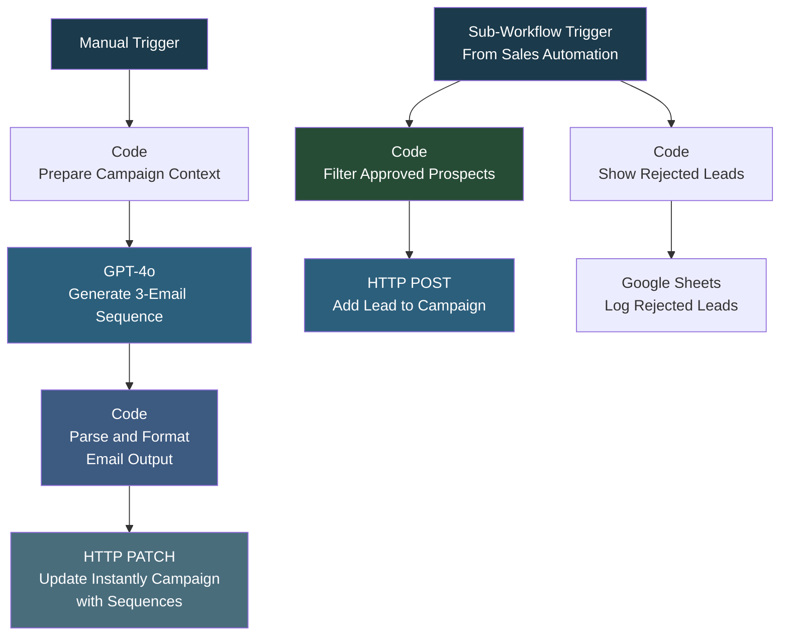

# Instantly Email Campaign Automation

## Overview

This workflow combines AI-generated email sequences with automated lead loading into Instantly campaigns. It has two main functions: (1) generating a personalized 3-email cold outreach sequence using GPT-4o and pushing it to an Instantly campaign as the email template, and (2) receiving leads from a parent workflow, filtering them by approval status, and adding qualified leads to the campaign. Rejected leads are logged to a separate sheet. This creates a complete end-to-end email campaign setup - from AI-written copy to loaded, ready-to-send leads.

## How It Works

**Email Template Generation:**
```
Manual Trigger -> Prepare Campaign Context (variables) -> GPT-4o Generate 3-Email Sequence -> Parse and Format Emails (HTML + Instantly variables) -> PATCH Instantly Campaign with Email Sequences
```

**Lead Loading (called by parent workflow):**
```
Sub-Workflow Trigger (from Sales Automation AI Review) -> Filter Approved Prospects -> Add Lead to Instantly Campaign
                                                       -> Filter Rejected -> Log Rejected to Sheet
```

### Workflow Diagram



### Workflow Steps

**Email Sequence Generation:**
1. **Prepare Campaign Context** - Sets up Instantly template variables (firstName, lastName, companyName, etc.) for the AI prompt.
2. **GPT-4o Email Generation** - Generates a 3-email cold outreach sequence using the PAS framework (Problem-Agitation-Solution). Email 1 is a contextual opener, Email 2 is a soft introduction, Email 3 shares a value example with specific metrics.
3. **Parse and Format** - Extracts subject lines and bodies from the AI output, replaces placeholders with Instantly merge variables, adds random greeting/sign-off variations, and wraps content in HTML paragraph tags.
4. **Update Instantly Campaign** - PATCHes the campaign with the 3-step email sequence, including a 3-day delay between emails and a weekday 9am-5pm ET sending schedule.

**Lead Loading:**
5. **Sub-Workflow Trigger** - Receives leads from the Sales Automation AI Review parent workflow.
6. **Filter Approved** - Checks Company Approved, Persona Approved, and valid email. Only approved leads are added.
7. **Add to Campaign** - Posts each lead to the Instantly API with personalization variables and duplicate-skip flags.
8. **Log Rejected** - Writes rejected leads with reasons to the Rejected Leads sheet tab.

## Integrations

- **Instantly** - Email campaign management, lead loading, and sequence configuration
- **OpenAI (GPT-4o)** - AI-generated personalized email sequences
- **Google Sheets** - Rejected lead logging

## Setup

1. Import `Instantly_Email_Campaign_Automation.json` into your n8n instance.
2. Configure credentials for Instantly, OpenAI, and Google Sheets.
3. Update the Instantly campaign ID in the PATCH and lead-loading nodes.
4. Customize the GPT-4o prompt with your company details, value proposition, and email tone.
5. Update the Google Sheet document ID for rejected lead logging.
6. If using as a sub-workflow, ensure the parent workflow passes leads in the expected format.
7. Activate the workflow.
